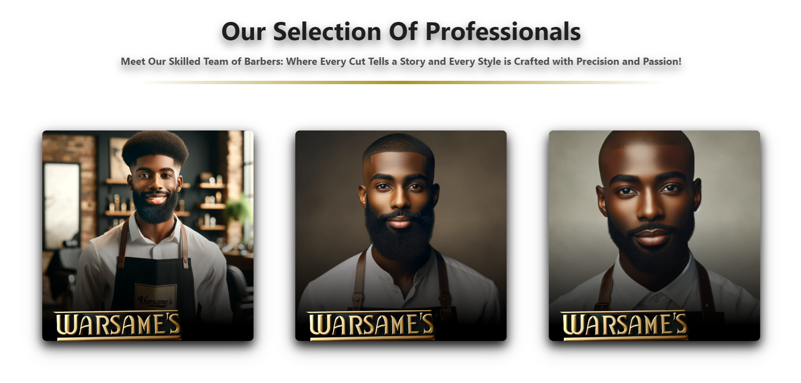
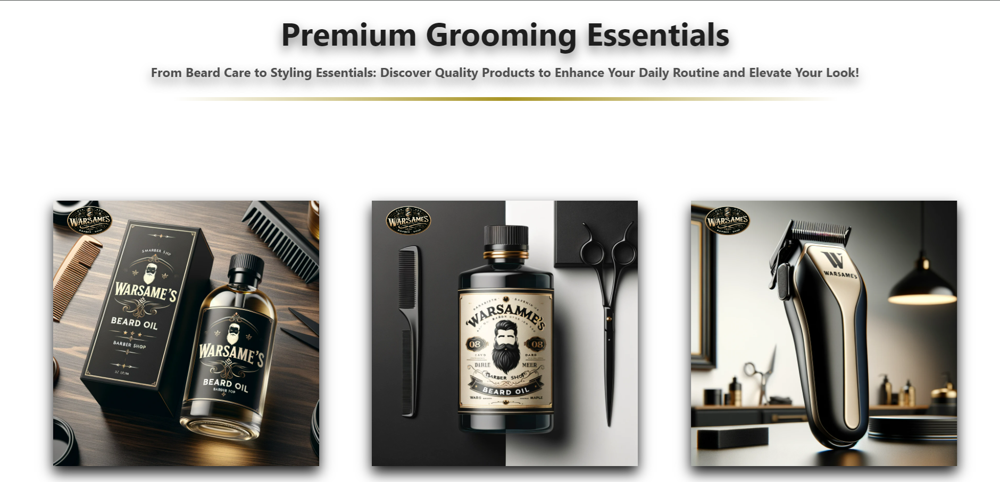

# Warsame's Barber

## Tagline

**It's a new day,a new opportunity to sculpt the best version of yourself. Embrace the transformation,and experience the art of grooming with precision and style. Step out with confidence and make your mark on the world.**

## Description

Warsame's Barber is a premier barber shop website that simplifies online booking. Users can easily choose their preferred barber, select the date and time for their appointment, and pick the specific services they need. This structure ensures a smooth and organized experience for scheduling haircuts and other grooming services.

## Live Demo

[Check out the live demo](https://barber-site-seven.vercel.app/)

---

## Table of Contents

1. [Features](#features)
2. [Screenshots](#screenshots)
3. [Installation](#installation)
4. [Usage](#usage)
5. [Support](#support)
6. [License](#license)

---

## Features

- **Online Booking:** Select your barber, date, and service for a hassle-free booking experience.
- **Professional Barbers:** View profiles of our skilled team members.
- **Premium Products:** Discover and purchase high-quality grooming products directly from our website.
- **Service Options:** Explore a variety of services tailored to your grooming needs.

## Screenshots

### Homepage


### Our Team



### Products



### Services


## Installation

To get started with the Warsame's Barber app, follow these steps:

1. **Clone the Repository**
   ```bash
   git clone https://github.com/abdinasir1warsame/warsames-barber.git
   ```
2. **Navigate to the Project Directory**

   ```bash
   cd barber-app
   ```

3. **Install Dependencies**
   ```bash
   npm install
   ```
4. **Install Dependencies**

   ```bash
   npm start
   ```
